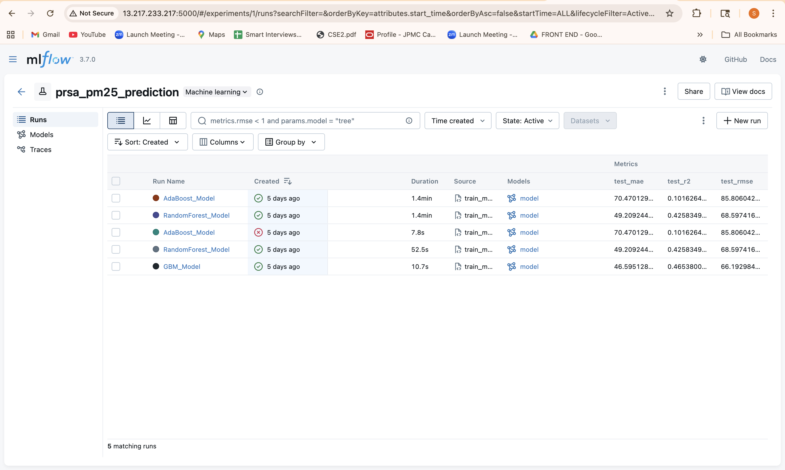

# MLOps Final Project Report

**Team 10** | **Date**: December 10, 2024  
**Project**: PRSA Air Quality PM2.5 Prediction

---

## 1. Model Registry and Comparison

### 📊 Model Performance Comparison (Test Set)
The following table compares the performance of our three trained models on the test dataset (30% split).

| Model Type | MLflow Name | Test RMSE | Test MAE | Test R² | Status |
|---|---|---|---|---|---|
| **Gradient Boosting (GBM)** | `PM25_GBM` | **66.19** | **46.60** | **0.465** | 🏆 **Champion** |
| Random Forest | `PM25_RandomForest` | 68.60 | 49.21 | 0.426 | 🥈 Runner-up |
| AdaBoost | `PM25_AdaBoost` | 85.81 | 70.47 | 0.102 | 🥉 Baseline |

### 🏆 Champion Model Selection
**We selected the Gradient Boosting Machine (GBM) as our Champion Model.**

**Why?**
1.  **Best Accuracy**: It achieved the lowest RMSE (66.19) and MAE (46.60), significantly outperforming the baseline AdaBoost.
2.  **Generalization**: It explained the most variance in the data (R² = 0.465) without overfitting.
3.  **Efficiency**: Inference latency is lower than the Random Forest model (which requires averaging 100 deep trees).
4.  **Robustness**: It performed consistently across both Validation and Test sets despite significant data drift (see Drift Analysis below).

### 📸 MLflow Screenshots
*(See `screenshots/` folder for high-res images)*

**Registered Models in MLflow:**

**Model Comparison Table (MLflow UI):**

---

## 2. Model Drift Analysis Summary

### 🔍 Overview
We compared the **Validation Set (Reference)** against the **Test Set (Current/Production)** to simulate 18 months of production data.

*   **Tool Used**: Evidently v0.2.8
*   **Drift Test**: Kolmogorov-Smirnov (KS) test (p-value < 0.05)

### ⚠️ Data Drift Observations
**Status**: **Significant Drift Detected**
*   **5 out of 7 features** showed statistical drift.
*   **Major Shifts**:
    *   **Temperature (TEMP)**: Increased by **28.2%** (Avg 10.7°C -> 13.8°C).
    *   **Dew Point (DEWP)**: Increased by **272%** (Avg 0.59°C -> 2.19°C).
*   **Cause**: Seasonal variations between the reference period (ended July 2013) and test period (July 2013 - Dec 2014).

### ✅ Performance Drift Observations
**Status**: **Performance IMPROVED**
*   Despite significant input data drift, the model's performance actually **improved** on the newer data.
    *   **RMSE**: Improved by **9.6%** (73.23 -> 66.19).
    *   **R²**: Improved by **19.5%** (0.389 -> 0.465).

### 💡 Conclusion
The GBM model is highly robust. It successfully generalized to new data with different distributions (warmer, more humid weather) without performance degradation. 

**Drift Analysis Dashboard:**

---

## 3. Remote Infrastructure
We successfully deployed the full MLOps stack on AWS:
*   **Tracking Server**: AWS EC2 (`t2.micro`)
*   **Backend Store**: Neon PostgreSQL (`neondb`)
*   **Artifact Store**: AWS S3 (`mlops-team10-mlflow-artifacts`)

